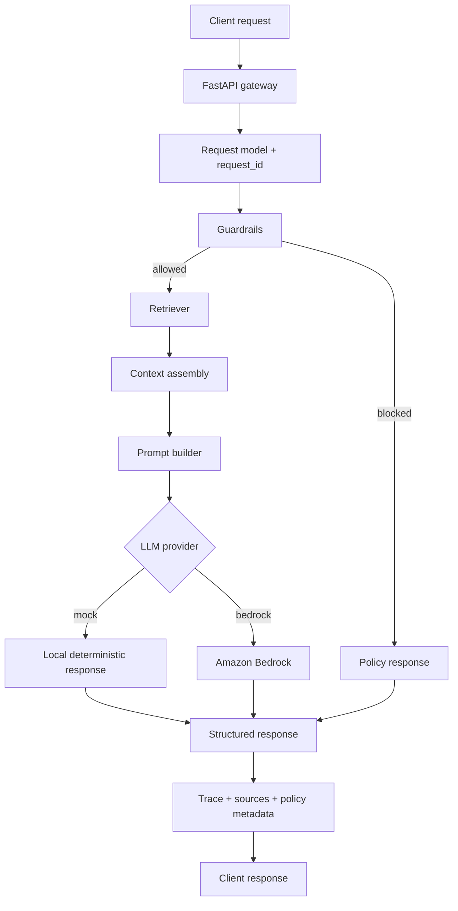
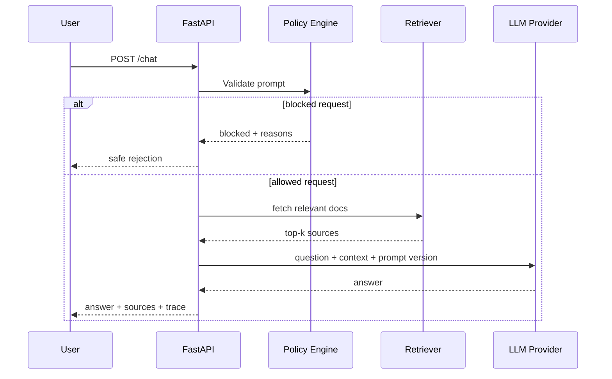

# Enterprise AI Platform Starter

A learning-first project for understanding how an enterprise AI platform request flows through guardrails, retrieval, orchestration, provider selection, evaluation, and API responses.

This project is intentionally light on infrastructure and heavy on flow visibility.

## Quick Start

Run these commands from `D:\Local\git_repos\ai-platform-projects`:

```powershell
python -m venv .venv
.\.venv\Scripts\activate
pip install -r requirements.txt
Copy-Item .env.example .env
uvicorn app.main:app --reload
```

## Project Status

Current status: complete as a learning and portfolio project.

What is already implemented:

- FastAPI AI gateway
- guardrails before inference
- retrieval over enterprise knowledge documents
- provider abstraction for mock mode and Amazon Bedrock
- traceable responses with request metadata and flow steps
- evaluation endpoint with repeatable test prompts
- automated tests and GitHub Actions CI

What can be added later:

- vector database integration
- Bedrock Knowledge Bases
- richer guardrails and policy checks
- screenshots and demo video for stronger portfolio presentation

Open:

- Swagger UI: `http://127.0.0.1:8000/docs`

Useful commands:

```powershell
python -m pytest
```

```powershell
Invoke-RestMethod -Method Post `
  -Uri http://127.0.0.1:8000/chat `
  -ContentType "application/json" `
  -Body '{"question":"How does provider abstraction help an enterprise AI platform?","top_k":2}'
```

```powershell
Invoke-RestMethod -Method Post `
  -Uri http://127.0.0.1:8000/retrieve `
  -ContentType "application/json" `
  -Body '{"query":"guardrails and observability","top_k":3}'
```

```powershell
Invoke-RestMethod -Method Post `
  -Uri http://127.0.0.1:8000/evals/run
```

## What You Will Learn

- How a platform-style AI API is structured
- How guardrails fit before model invocation
- How retrieval adds business context
- How provider abstraction supports local and cloud execution
- How evaluations can be built into the platform
- How request tracing improves observability and supportability

## Flow Diagram



## Sequence View



## Project Structure

```text
.
|-- app/
|   |-- config.py
|   |-- evals.py
|   |-- guardrails.py
|   |-- knowledge.py
|   |-- main.py
|   |-- models.py
|   |-- platform.py
|   |-- providers.py
|   `-- retrieval.py
|-- data/
|   |-- evals.json
|   `-- knowledge_base.json
|-- docs/
|   `-- learning-flow.md
|-- tests/
|   |-- conftest.py
|   `-- test_api.py
|-- .env.example
|-- .gitignore
|-- README.md
`-- requirements.txt
```

## API Endpoints

- `GET /health`: basic platform health and active provider
- `GET /knowledge-base`: list loaded knowledge documents
- `POST /retrieve`: view retrieval results only
- `POST /chat`: run full platform flow
- `POST /evals/run`: run a tiny built-in evaluation dataset

## Local Run

```powershell
python -m venv .venv
.\.venv\Scripts\activate
pip install -r requirements.txt
copy .env.example .env
uvicorn app.main:app --reload
```

Open Swagger at `http://127.0.0.1:8000/docs`.

## Mock Mode

Default mode is `mock`, which means:

- no cloud account is required
- the response is deterministic
- you can study the full control flow safely

## Optional Bedrock Mode

If you want cloud exposure later:

```powershell
$env:LLM_PROVIDER="bedrock"
$env:AWS_REGION="ap-south-1"
$env:BEDROCK_MODEL_ID="amazon.nova-lite-v1:0"
uvicorn app.main:app --reload
```

If Bedrock is unavailable, the API returns a clear provider error.

## Bedrock Quick Start

Use this when you want to move from local mock execution to AWS Bedrock.

### 1. Configure AWS credentials

```powershell
aws configure
```

### 2. Confirm your AWS identity

```powershell
aws sts get-caller-identity
```

### 3. Start the app with Bedrock enabled

```powershell
$env:LLM_PROVIDER="bedrock"
$env:AWS_REGION="ap-south-1"
$env:BEDROCK_MODEL_ID="amazon.nova-lite-v1:0"
uvicorn app.main:app --reload
```

### 4. Test the Bedrock-backed chat flow

```powershell
Invoke-RestMethod -Method Post `
  -Uri http://127.0.0.1:8000/chat `
  -ContentType "application/json" `
  -Body '{"question":"How do guardrails and retrieval fit into an enterprise AI platform?","top_k":2}'
```

Expected behavior:

- if AWS credentials and model access are valid, the response `provider` becomes `bedrock`
- if access is not ready, the API returns a provider error that helps you troubleshoot

## Interview Explanation Flow

Use this flow when explaining the project in interviews.

### Short Version

"This project is a learning-first enterprise AI platform starter. I designed it to show how an AI request moves through policy checks, retrieval, provider abstraction, and evaluation, instead of only building a basic chatbot."

### End-to-End Request Flow

1. A client sends a question to the FastAPI gateway through `/chat`.
2. The platform creates a `request_id` so the interaction is traceable.
3. A guardrail layer checks the input for unsafe phrases, secret patterns, and policy violations.
4. If the request is blocked, the model call is skipped and the platform returns a safe response.
5. If the request is allowed, the retriever searches enterprise documents for relevant context.
6. The platform assembles the question plus retrieved context into a provider-ready prompt.
7. The provider abstraction routes the request either to a local mock provider or to Amazon Bedrock.
8. The response is returned with answer text, sources, prompt version, guardrail status, and trace steps.

### Why This Matters

- It demonstrates reusable platform patterns rather than a one-off AI app.
- It shows secure-by-design thinking because guardrails run before inference.
- It shows operability because every response includes traceable metadata.
- It shows cloud readiness because the same platform logic can call Bedrock without changing the API layer.
- It shows quality thinking because evals are part of the platform, not an afterthought.

### How To Explain Mock vs Bedrock

"I built the project with a provider abstraction. In mock mode, I can safely learn and test the end-to-end control flow without depending on cloud access. In Bedrock mode, the same orchestration path is reused, but the provider layer sends the final prompt to AWS Bedrock using the Converse API."

### How To Explain The Retrieval Layer

"The retrieval layer grounds the response in approved platform knowledge. Right now it uses a lightweight lexical search so the request flow is easy to understand and debug. In a more advanced version, this same layer could be swapped with a vector database or Bedrock Knowledge Bases."

### How To Explain The Evaluation Layer

"The project also includes a small `/evals/run` endpoint that executes fixed test prompts and checks expected keywords. It is a simple example of how AI platform teams can build repeatable quality checks before releasing changes."

## Suggested Learning Order

1. Call `/chat` in mock mode and inspect the response trace.
2. Call `/retrieve` to understand how context is selected.
3. Send a blocked prompt and inspect the guardrail result.
4. Run `/evals/run` to see how platform testing can work.
5. Switch to Bedrock only after you understand the local flow.

## Resume Angle

This project is suitable for roles asking for:

- AI platform engineering
- reusable AI services and APIs
- GenAI orchestration and retrieval
- model provider abstraction
- platform observability and governance
- production-style Python backend implementation
