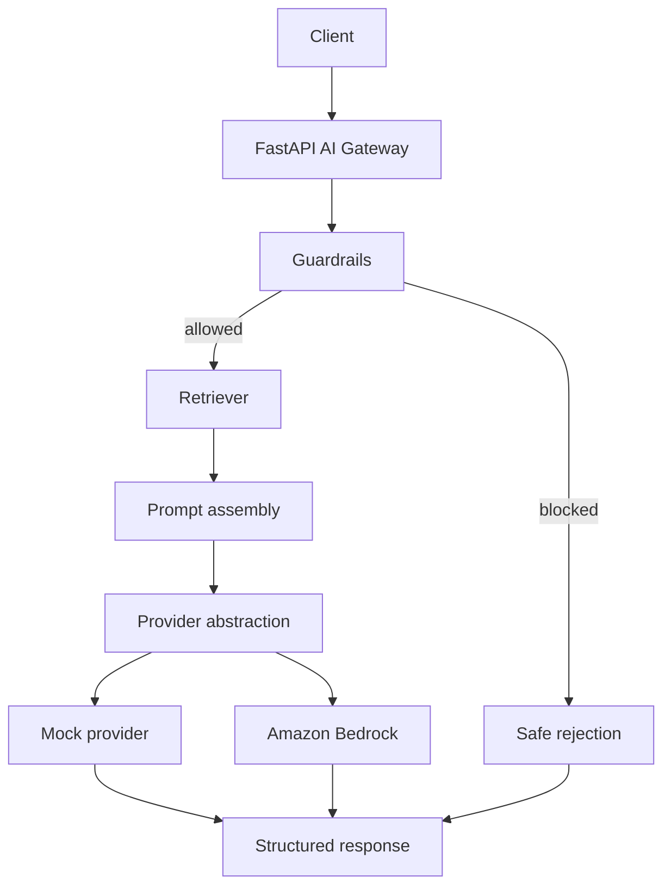

# Enterprise AI Platform Showcase

A polished portfolio presentation of the `Enterprise AI Platform Starter` project for GitHub and LinkedIn.

## Recommended Use

Use this content if you decide to create a separate public-facing repo for personal branding.

Suggested repo name:

- `enterprise-ai-platform-showcase`

Suggested branch name:

- `linkedin-showcase-assets`

## Positioning Statement

This project demonstrates how an enterprise AI platform request moves through guardrails, retrieval, provider abstraction, evaluation, and traceable API responses.

It is designed to show platform engineering thinking rather than only a basic chatbot implementation.

## What This Project Demonstrates

- reusable AI platform APIs with FastAPI
- guardrails before inference
- retrieval for enterprise grounding
- provider abstraction for mock and Amazon Bedrock execution
- evaluation-driven quality checks
- traceability through request IDs, sources, and flow steps

## Architecture Summary

## Why This Is Useful For Interviews

- It shows how platform services are built, not only how prompts are sent.
- It demonstrates governance, supportability, and API design.
- It provides a concrete example for discussing secure AI platform delivery.
- It creates a bridge between platform engineering, MLOps, and GenAI delivery.

## Suggested Sections For A Public Repo

1. Problem statement
2. Architecture diagram
3. Request flow
4. API examples
5. Mock mode vs cloud mode
6. Guardrails and evaluation approach
7. Resume-ready impact bullets

## Resume-Ready Project Bullets

- Built a learning-first enterprise AI platform starter using FastAPI, retrieval, guardrails, provider abstraction, and evaluation endpoints.
- Designed the platform flow to expose request tracing, policy outcomes, source grounding, and cloud-ready provider switching.
- Implemented an optional Amazon Bedrock integration while preserving a deterministic local execution mode for faster learning and safer testing.

